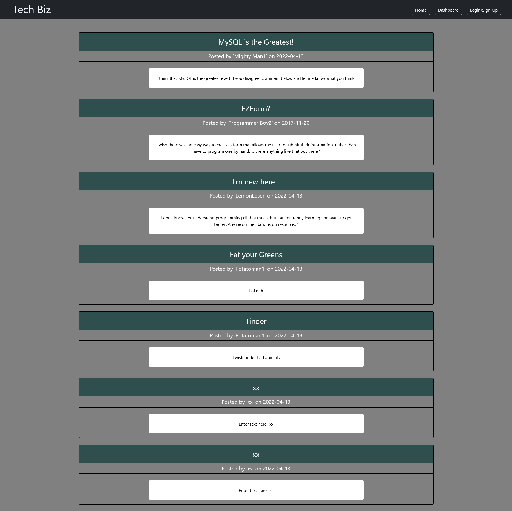

# Tech Biz Blog

## Description

A blogging app that allows for multiple individual connections, allows the creation of individual profiles, and retains all information regarding posts and comments for those users. 

Some features of the application are:
- The ability to create and account or 'Sign Up', then log back into the account at a later time
- Once an account is created, it's password is hashed and stored in a database
- Home page shows all posts saved in the database with relevant info (such as author and date created)
- While a visitor is not logged in, all links/clickables redirect the user to the login/sign-up page
- After loggin in, user can access a 'dashboard' in order to see all of their own posts.
- Users have the ability to create posts, edit posts, delete posts, and comment on posts

Planned/Upcoming features:
- Ability to delete comments
- Ability to have an administrative account
- Ability to sort posts by date
- Ability to view comments you posted on dashboard

Dependencies for this project:
- [Bcrypt](https://github.com/pyca/bcrypt) for password hashing
- [connect-session-sequelize](https://github.com/mweibel/connect-session-sequelize) as a connection store
- [Dotenv](https://github.com/motdotla/dotenv) to refrence app related environment variables
- [Express](https://github.com/expressjs/express) web frameword for node
- [Express-handlebars](https://github.com/ericf/express-handlebars) for rendering dynamic html
- [Express-session](https://github.com/expressjs/session) for session middleware management
- [Node MySQL2](https://github.com/sidorares/node-mysql2) MySQL client for node
- [Sequelize](https://github.com/sequelize/sequelize) ORM tool for MySQL

## Table of Contents

1.  [Installation](#installation)

2.  [Usage](#usage)

3.  [License](#license)

4.  [Contributing](#contributing)

5.  [Questions](#questions)

6.  [Finished Product](#finished-product)

---

## [Installation](#installation)

This application should be hosted locally via Heroku at [here](https://tech-biz-blog.herokuapp.com/). However, if the application is no longer running, or you just wish to run it locally, you can follow these instructions:

>## Step One
>Download or Clone this repo
>
>You can either download the repo as a zip file and unzip it to your computer, or you can clone it down to your computer directly. If you are unfamiliar with how to do that latter option, please refer to this [how to](https://support.atlassian.com/bitbucket-cloud/docs/clone-a-git-repository/) demo using gitbash.

>## Step Two
>Navigate to App Directory
>
>Make sure you are in the directory of the application. It should be a folder named tech-biz-blog. Open up a CLI on that directory.
>If you are not sure you are in the right place, enter 'pwd' into the command line and check that the last directory on the tree is the app directory.

>## Step Three
>Install Dependencies
>
>While you are located in the app directory, enter 'npm install'. This should cause the application to find and install all necessary dependencies.

>## Step Four
>Edit & Rename .env.Example
>
>The file named '.env.Example' needs to be renamed to '.env' and the environment variables in the file need to be refactored. Primarily the DB_PW and SESH_SECRET variables. DB_PW is the password for accessing your database, and SESH_SECRET can be any string you wish it to be.

>## Step Five
>Create Database and Seed
>
>In the /tech-biz-blog/db directory, there is a schema that you can use to create a database for the app. If you wish to load information into that database prior to starting the app, simply enter 'npm run seed' into the CLI while it's located at the root directory of the app.

>## Step Six
>Star the application
>
>In the command line, enter 'npm run start'. As long as there are no errors, this should start the server and run it at [http://localhost:3001](http://localhost:3001)

## [Usage](#usage)

>## Step One
>Run the application
>
>As mentioned in the installation section, install and run the application.

>## Step Two
>First time accessing
>
>When you first load into the app, it should load the home page. From here there are several navigational links and (if you seeded the database) some existing posts.

>## Step Three
>Login or Create and account
>
>Any of the links or posts you click will take you to the login/sign up page since you are not logged in. When you are at the login/sign up page, enter a username, password, and confirm you password on the signup form, or login with one of the seeded accounts.
>
>Seeded profiles:
>- Username: Mighty Man1     | Password: testpass1
>- Username: Programmer Boy2 | Password: testpass2
>- Username: Math Girl3      | Password: testpass3

>## Step Four
>Create, edit, delete posts
>
>After you are logged in, you should see your username at the top as confirmation. While logged in, you can either click on a post directly from the home page, or visit your dashboard to see your own posts and access them from there. In the dashboard you have the option to create a new post as well. When viewing a a post that is your own, you will see two options in a faint, red outline under the post's main content. The 'Edit' button allows you to change the content of the post, and the 'Delete button allows you to delete the post and it's comments.

>## Step Five
>Comments
>
>To view or add comments on a post, click the 'Comments' button outlined in white underneath the post. This will open up all comments attached to the post, as well as introduce a new 'Add Comment' button. If you click the 'Add' Comment' button, you can enter a message into the text area that appears and submit it to be added to the post as a new comment.

>## Step Six
>Logging Out
>
>To log out, simply click the 'Log Out' button at the top left where the 'Login/Sign Up' button was originally. It will ask you to confirm if you wish to log out. After confirming you should get a message that confirms a successful log out and the username at the top of the page should disappear.

---

## [License](#license)

 Copyright (c) 2022 Vidalatan Licensed under the MIT License license.

---

## [Contributing](#contributing)

Thank you for considering contributing to this project!

Following these contributing guidelines helps communicate that you respect the time of those who are managing and developing this open source project.
In return, you should recieve that same respect back in addressing your issue, assessing changes, and helping you finalize your pull requests.

There are many ways to contribute from documentation, tutorials, social media, but reports, feature requests or submitting your own code. Please feel 
encouraged to assist in any way applicable to your skills!

## [Questions](#questions)

 Questions regarding this project should be directed towards @Vidalatan at vidalatan@gmail.com

---

## [Finished Product](#finished_product)

Link to live [Tech Biz Blog](https://tech-biz-blog.herokuapp.com/)

Link to [Code Repository](https://github.com/vidalatan/tech-biz-blog)

